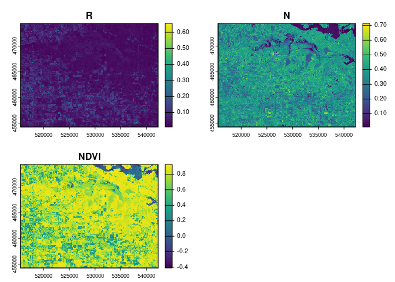
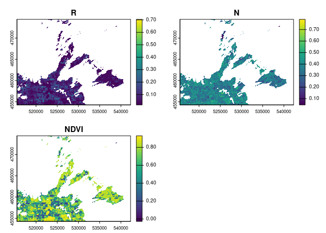
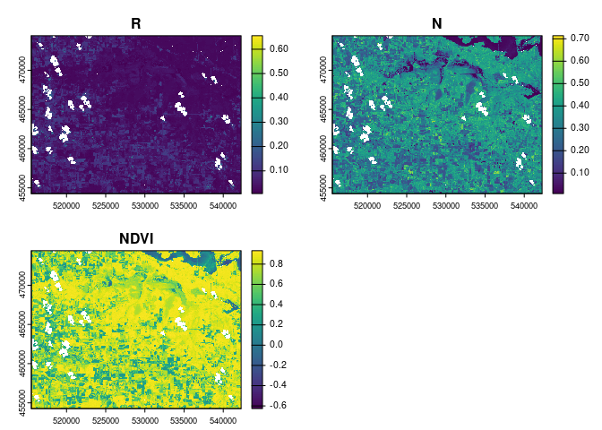

<!-- README.md is generated from README.Rmd. Please edit that file -->

# geopipeline

<!-- badges: start -->
<!-- badges: end -->

The goal of geopipeline is to streamline the data access and processing
of geospatial datasets, particularly for modeling workflows. geopipeline
makes it easy to produce 2 types of outputs:

1.  **Data Frame** - Produced as an output when a user wants to extract
    the values associated with particular points in a region of
    interest. The data frame can return the pixel values at the exact
    point locations, or the pixel values of all pixels that fall within
    a specified radius of the point locations. The data frame format may
    be useful for training a model.

2.  **GeoTIFF File(s)** - Produced as an output when the user wants to
    extract the values associated with an entire region of interest.
    When a user defines an area of interest as a polygon, the output of
    the core geopipeline functions is a GeoTIFF file of the bounding box
    for the polygon.

There are currently 7 core functions in geopipeline that can return data
frame or GeoTIFF outputs for 7 unique datasets:

1.  `s2_process` - Sentinel-2 L2A
2.  `s1_process` - Sentinel-1 Radiometrically Terrain Corrected
3.  `dem_process` - Copernicus DEM GLO-30
4.  `esa_worldcover_process` - ESA WorldCover
5.  `alos_fnf_process` - ALOS Forest/Non-Forest
6.  `soil_process` - ISRIC Soil Grids
7.  `gedi_process` - GEDI L3

I would like to specifically acknowledge and cite the `rsi` package from
[Permian-Global-Research](https://github.com/Permian-Global-Research/rsi/tree/main)
which is the foundation for accessing, processing, and calculating
indices for the first 5 datasets listed above. That package is truly
incredible and has made working on this project much easier! Additional
functionality I have built on top of `rsi` for the intended modeling use
case of geopipeline includes:

- Creating a data frame output for regions of interest based on point
  geometries
- Adding the ability to spatially mosaic neighboring image tiles when
  temporal compositing is not applied for both Sentinel-2 L2A data and
  Sentinel-1 RTC GRD data.

*Still to come:*

- A quick function for stacking and labeling non-composited images
  covering the same spatial extent.
- A function for summarizing pixel values within a buffer based on a
  user-defined formula.
- Core functions for accessing GEDI L2A and L2B gridded datasets.

## Installation

You can install the development version of geopipeline from
[GitHub](https://github.com/) with:

``` r
# install.packages("devtools")
devtools::install_github("laurenkwick/geopipeline")
```

## Example

Begin by loading example data. In this example, the region of interest
is the George W Mead Wildlife Area in Wisconsin. The point data includes
fires that recently occurred within the wildlife area. Data for this
example was acquired from [GeoData@Wisconsin](https://geodata.wisc.edu/)

``` r
library(geopipeline)

sf_point <- sf::st_read("~/ProcessingModule/national_forest_data/mead_fires.shp")
#> Reading layer `mead_fires' from data source 
#>   `/home/lwick/ProcessingModule/national_forest_data/mead_fires.shp' 
#>   using driver `ESRI Shapefile'
#> Simple feature collection with 77 features and 25 fields
#> Geometry type: POINT
#> Dimension:     XY
#> Bounding box:  xmin: 524429.1 ymin: 457321 xmax: 541478.1 ymax: 472452.7
#> Projected CRS: NAD83(HARN) / Wisconsin Transverse Mercator
sf_poly <- sf::st_read("~/ProcessingModule/national_forest_data/mead_boundary.shp", type = 3)
#> Reading layer `mead_boundary' from data source 
#>   `/home/lwick/ProcessingModule/national_forest_data/mead_boundary.shp' 
#>   using driver `ESRI Shapefile'
#> converted into: POLYGON
#> Simple feature collection with 1 feature and 5 fields
#> Geometry type: POLYGON
#> Dimension:     XY
#> Bounding box:  xmin: 515559.2 ymin: 454316.2 xmax: 542226.3 ymax: 474365.1
#> Projected CRS: NAD83(HARN) / Wisconsin Transverse Mercator
```

### July - Temporal Compositing

We will use s2_process to return a GeoTIFF for the region of interest
and a data frame containing values for our specific points of interest.

``` r
# Polygon data
s2_composite_im <- s2_process(sf_poly, start_dt = "2024-07-01", end_dt = "2024-07-31",
                              layers_sel = c("red", "nir"), 
                              composite_method = "median", idx_names = "NDVI", 
                              file_path = tempfile(pattern="s2_composite_im", tmpdir=tempdir()))
#> 1 indices were found based on criteria.
#> File saved to: /tmp/RtmpQMpMku/s2_composite_im10565dec0c20_2024-07-01_2024-07-31.tif

# Point data
s2_composite_df <- s2_process(sf_point, start_dt = "2024-07-01", end_dt = "2024-07-31",
                              uniqueID = "FIRE_ID", layers_sel = c("red", "nir"), 
                              composite_method = "median", idx_names = "NDVI",
                              file_path = tempfile(pattern="s2_composite_df", tmpdir=tempdir()))
#> No radius defined. Will not apply a buffer to the point data.
#> 1 indices were found based on criteria.
#> File saved to: /tmp/RtmpQMpMku/s2_composite_df1056178d441b.fst
```

Plot the image:

 View
the data frame. In geopipeline, data frames are serialized as an fst
file by default, because they can very quickly become very large. To
read in the data frame, use `fst::read_fst()`:

``` r
# Data frame
s2_df_composite <- fst::read_fst(s2_composite_df)
head(s2_df_composite)
#>     ID       R      N      NDVI
#> 1  170 0.05030 0.3488 0.7479329
#> 2 1285 0.02765 0.4545 0.8853054
#> 3 2417 0.09875 0.2833 0.4830520
#> 4 3938 0.10680 0.2755 0.4412765
#> 5 4707 0.04650 0.4309 0.8051948
#> 6 4708 0.05350 0.4168 0.7724857
```

IDs in the data frame “ID” column correspond to the ID from our original
shapefile attribute table, which we specified in the `s2_process`
function using `uniqueID = "FIRED_ID"`. In the previous example, we have
one pixel (or one row) per point in our original shapefile. In this next
example, we will use the `radius` argument to grab all pixels that fall
within a 100m distance to each point:

``` r
# Run s2_process
s2_composite_radius_df <- s2_process(sf_point, radius = 100, start_dt = "2024-07-01", end_dt = "2024-07-31",
                                     uniqueID = "FIRE_ID", layers_sel = c("red", "nir"), 
                                     composite_method = "median", idx_names = "NDVI",
                                     file_path = tempfile(pattern="s2_composite_radius_df", tmpdir=tempdir()))
#> 1 indices were found based on criteria.
#> File saved to: /tmp/RtmpQMpMku/s2_composite_radius_df10565a719c05.fst

# Read data frame
s2_df_composite_radius <- fst::read_fst(s2_composite_radius_df)
head(s2_df_composite_radius)
#>    ID      R      N      NDVI
#> 1 170 0.0414 0.3550 0.7911201
#> 2 170 0.0421 0.3605 0.7908594
#> 3 170 0.0413 0.3558 0.7919919
#> 4 170 0.0418 0.3496 0.7864078
#> 5 170 0.0420 0.3463 0.7836724
#> 6 170 0.0431 0.3530 0.7823782
```

We can see that there are now several rows associated with FIRE_ID 170.

### July - No Temporal Compositing

If we do not want apply a temporal composite over the time range, we can
return all images that were acquired within the date range. If the
region of interest spans over multiple Sentinel-2 L2A, geopipeline will
still mosaic neighboring image tiles, as long as they were acquired on
the same day. GeoTIFF files will be saved with the date of acquisition
appended at the end. These files can be converted into raster data and
stacked to create one large raster.

In the case of data frames, only one data frame is returned with each
column of the data frame having an associated date of acquisition.

In this next example, we will run `s2_process` without applying a
compositing function:

``` r
# Polygon data
s2_no_composite_im <- s2_process(sf_poly, start_dt = "2024-07-01", end_dt = "2024-07-31",
                                 layers_sel = c("red", "nir"), 
                                 composite_method = NULL, idx_names = "NDVI", 
                                 file_path = tempfile(pattern="s2_no_composite_im", tmpdir=tempdir()))
#> 1 indices were found based on criteria.
#> File saved to: /tmp/RtmpQMpMku/s2_no_composite_im10561653e040_2024-07-01.tif
#> File saved to: /tmp/RtmpQMpMku/s2_no_composite_im10561653e040_2024-07-06.tif
#> File saved to: /tmp/RtmpQMpMku/s2_no_composite_im10561653e040_2024-07-11.tif
#> File saved to: /tmp/RtmpQMpMku/s2_no_composite_im10561653e040_2024-07-16.tif
#> File saved to: /tmp/RtmpQMpMku/s2_no_composite_im10561653e040_2024-07-21.tif
#> File saved to: /tmp/RtmpQMpMku/s2_no_composite_im10561653e040_2024-07-26.tif
#> File saved to: /tmp/RtmpQMpMku/s2_no_composite_im10561653e040_2024-07-31.tif

# Point data
s2_no_composite_df <- s2_process(sf_point, start_dt = "2024-07-01", end_dt = "2024-07-31",
                                 uniqueID = "FIRE_ID", layers_sel = c("red", "nir"), 
                                 composite_method = NULL, idx_names = "NDVI",
                                 file_path = tempfile(pattern="s2_no_composite_df", tmpdir=tempdir()))
#> No radius defined. Will not apply a buffer to the point data.
#> 1 indices were found based on criteria.
#> There are 58 out of 77 rows with NA values.
#> There are 1 out of 77 rows with NA values.
#> There are 21 out of 77 rows with NA values.
#> There are 43 out of 77 rows with NA values.
#> There are 77 out of 77 rows with NA values.
#> File saved to: /tmp/RtmpQMpMku/s2_no_composite_df105653568533.fst
```

Choosing to not apply a compositing funciton may be useful if you want
to perform complex time series analysis later on, one that takes
seasonal variation into account.

We will visualize the results now:



View the dataframe:

``` r
# Data frame
s2_df_no_composite <- fst::read_fst(s2_no_composite_df)
head(s2_df_no_composite)
#>     ID 2024-07-01 R 2024-07-01 N 2024-07-01 NDVI 2024-07-06 R 2024-07-06 N
#> 1  170           NA           NA              NA       0.0452       0.3187
#> 2 1285           NA           NA              NA       0.0226       0.4451
#> 3 2417           NA           NA              NA       0.0730       0.2313
#> 4 3938           NA           NA              NA       0.1068       0.1619
#> 5 4707           NA           NA              NA       0.0373       0.4204
#> 6 4708           NA           NA              NA       0.0389       0.4099
#>   2024-07-06 NDVI 2024-07-11 R 2024-07-11 N 2024-07-11 NDVI 2024-07-16 R
#> 1       0.7515801       0.0504       0.3455       0.7453902       0.0479
#> 2       0.9033569       0.0273       0.4734       0.8909526       0.0280
#> 3       0.5202103           NA           NA              NA           NA
#> 4       0.2050614       0.1446       0.2755       0.3115925           NA
#> 5       0.8370112       0.0472       0.4448       0.8081301       0.0458
#> 6       0.8266488       0.0615       0.4761       0.7712054       0.0455
#>   2024-07-16 N 2024-07-16 NDVI 2024-07-21 R 2024-07-21 N 2024-07-21 NDVI
#> 1      0.36245       0.7665408           NA           NA              NA
#> 2      0.46390       0.8861557           NA           NA              NA
#> 3           NA              NA           NA           NA              NA
#> 4           NA              NA           NA           NA              NA
#> 5      0.44140       0.8119869           NA           NA              NA
#> 6      0.42370       0.8060529           NA           NA              NA
#>   2024-07-26 R 2024-07-26 N 2024-07-26 NDVI 2024-07-31 R 2024-07-31 N
#> 1       0.0615       0.3798       0.7212781      0.04465       0.3193
#> 2       0.0370       0.3979       0.8298460      0.02870       0.3903
#> 3       0.1245       0.3353       0.4584602      0.08020       0.3328
#> 4       0.0999       0.2991       0.4992481      0.04310       0.3183
#> 5       0.0929       0.2954       0.5215040      0.05840       0.3618
#> 6       0.0861       0.3627       0.6163102      0.04870       0.4162
#>   2024-07-31 NDVI
#> 1       0.7546366
#> 2       0.8630072
#> 3       0.6116223
#> 4       0.7614831
#> 5       0.7220371
#> 6       0.7904926
```
